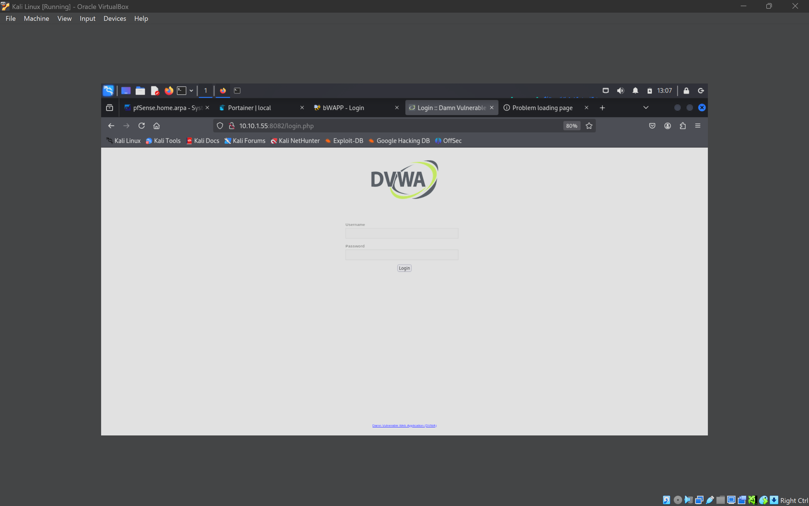

# Cybersecurity-Home-Lab

This documentation presents a comprehensive breakdown of my self-assembled Cybersecurity Home Lab—an integrated virtual network of enterprise-grade tools and systems built on VirtualBox, focused on practical, hands-on cybersecurity training. It is a one-stop platform for simulating cyberattacks, deploying security defenses, and practicing incident detection and response. With the use of open-source and enterprise tools, realistic scenarios, and carefully structured components, this project reflects my initiative to replicate a real-world SOC (Security Operations Center) within the confines of a home setup.

The lab provides a multi-tiered environment with tools and targets ranging from SIEM platforms, vulnerability scanners, and firewalls to Active Directory domains and vulnerable machines. Each component interacts as part of a cohesive ecosystem governed by custom firewall rules, DHCP services, and SIEM correlation. It is purpose-built for practicing ethical hacking, cyber defense, threat intelligence integration, log analysis, and adversary emulation.

---

## Project Goals and Vision

This project was initiated with the goal of transforming theoretical knowledge of cybersecurity into practical, experiential learning. The primary objectives are:

- To build a controlled, isolated, and flexible environment to explore modern cyber threats and defensive strategies.
- To simulate red and blue team operations in a safe and repeatable environment.
- To integrate core infrastructure components including AD, DNS, DHCP, SIEM, IDS, firewalls, and vulnerability scanners.
- To develop scripts and automation workflows that reflect real-world SOC operations.

The lab has evolved to function like a miniature enterprise network, offering both offensive and defensive cyber scenarios to hone practical expertise in a realistic, risk-free space.

---

## Network Infrastructure Overview

The core infrastructure is built on VirtualBox with a single flat subnet: `10.10.1.0/24`, managed by pfSense. This subnet facilitates seamless communication among all systems while allowing firewall control, monitoring, and segmentation practices. 

### Key Infrastructure Nodes:

- `pfSense` (Gateway + Firewall): `10.10.1.254`
- `Kali Linux` (Penetration Testing): `10.10.1.50`
- `Ubuntu Server` (Docker/Portainer): `10.10.1.65`
- `Wazuh Server` (SIEM): `10.10.1.49`
- `Nessus` (Scanner): `10.10.1.59`
- `MITRE Caldera` (Adversary Simulation): `10.10.1.63`
- `Windows Server 2022` (Domain Controller): `10.10.1.80`
- `Windows 10 Client` (Workstation): `10.10.1.90`
- `Metasploitable2` (Vulnerable Host): `10.10.1.57`

VirtualBox was chosen for its performance, ease of use, snapshot capability, and broad community support. All VMs are configured using Internal Network mode to simulate LAN communication.

---

## Core Security Stack Components

### pfSense (Firewall + Gateway)

pfSense plays a foundational role in the lab, offering packet filtering, NAT, port forwarding, DHCP, and DNS services. Firewall rules were crafted to simulate segmentation and least-privilege access between the VMs. Logs are continuously monitored and exported via remote syslog to Wazuh.

Noteworthy configurations include:

- DHCP Range: `10.10.1.50 - 10.10.1.100`
- DNS Forwarder: Configured for internal and external name resolution
- OpenVPN (Planned): To simulate secure remote access

<p align="center">
  
  <br>
  <strong><em>Figure 1:</em></strong> <em>pfSense Dashboard showing interface and system status</em>
</p>

<p align="center">
  
  <br>
  <strong><em>Figure 2:</em></strong> <em>pfSense Firewall Rules for LAN interface</em>
</p>

### Wazuh (SIEM + XDR)

Wazuh acts as the brain of the security monitoring system. Installed on Ubuntu (`10.10.1.49`), it collects logs and telemetry from:

- Windows Server (Windows Event Logs, Sysmon)
- Ubuntu Server + Docker (Auditd + Syslog)
- Kali Linux (Command Execution Monitoring)
- pfSense (Firewall and DHCP logs via syslog)

Wazuh policies were configured to:

- Monitor file integrity, kernel module loads, and SSH sessions
- Detect brute-force, privilege escalation, and remote access attempts
- Enrich logs with GeoIP and MITRE ATT&CK tags

<p align="center">
  
  <br>
  <strong><em>Figure 3:</em></strong> <em>Wazuh Dashboard displaying security alerts</em>
</p>

<p align="center">
  
  <br>
  <strong><em>Figure 4:</em></strong> <em>MITRE ATT&CK Mapping in Wazuh</em>
</p>

### Nessus (Vulnerability Scanning)

Installed on IP `10.10.1.59`, Nessus scans critical systems for vulnerabilities using customized scan policies. Reports highlight unpatched services, software flaws, insecure protocols (FTP, SMBv1), and open ports.

Scan reports were used to:

- Validate the results of manual scans from Kali Linux
- Assess patch levels of Windows Server and Ubuntu
- Test detection accuracy of Wazuh against known exploits

<p align="center">
  
  <br>
  <strong><em>Figure 5:</em></strong> <em>Nessus Vulnerability Overview</em>
</p>

<p align="center">
  
  <br>
  <strong><em>Figure 6:</em></strong> <em>Nessus running in ubuntu</em>
</p>

### MITRE Caldera (Red Team Automation)

Caldera provides a means to run adversary emulation campaigns. Running on IP `10.10.1.63`, it uses the Sandcat agent to simulate advanced techniques:

- Privilege Escalation via token impersonation
- Lateral Movement using PsExec
- Credential Access using LSASS dumps
- Defense Evasion with registry modifications

Campaigns are configured through profiles mapped to real-world APT behaviors. Wazuh logs all activity and automatically raises alerts via custom rules.

<p align="center">
  
  <br>
  <strong><em>Figure 7:</em></strong> <em>MITRE Caldera Operation Dashboard</em>
</p>

<p align="center">
  
  <br>
  <strong><em>Figure 8:</em></strong> <em>Caldera Agent and Tactic Deployment View</em>
</p>

---

## Exploitation Sandbox

### Kali Linux (Red Team Host)

Kali Linux is the red team nucleus used for offensive testing and security evaluation. Tools used:

- `Nmap` and `Netdiscover` for network enumeration
- `Burp Suite` and `OWASP ZAP` for web app testing
- `SQLMap`, `Hydra`, `John`, and `Nikto` for various attacks

Tested Targets:

- `Metasploitable2`: Unsecured services (Telnet, vsFTP, Samba)
- `DVWA`: SQLi, XSS, Command Injection
- `WebGoat`: Broken Auth, Insecure Deserialization
- `bWAPP`: File upload vulnerabilities

Each attack vector was validated through manual exploitation and log correlation in Wazuh.

<p align="center">
  
  <br>
  <strong><em>Figure 9:</em></strong> <em>Metasploit Overview</em>
</p>

<p align="center">
  
  <br>
  <strong><em>Figure 10:</em></strong> <em>Wazuh connected on Kali Linux</em>
</p>

---

## Docker Ecosystem

The Ubuntu Server at `10.10.1.55` runs Docker and Portainer. Vulnerable apps were containerized for efficiency and isolation:

- `dvwa:latest` on port `8081`
- `webgoat/webgoat-8.0` on port `8082`
- `raesene/bwapp` on port `8083`

Portainer provides a user-friendly GUI to manage containers, inspect logs, and track resource usage. This section demonstrates practical DevSecOps principles in vulnerability testing.

<p align="center">
  
  <br>
  <strong><em>Figure 11:</em></strong> <em>Portainer on ubuntu server</em>
</p>

<p align="center">
  
  <br>
  <strong><em>Figure 12:</em></strong> <em>DVWA Login Page via Docker</em>
</p>

<p align="center">
  
  <br>
  <strong><em>Figure 13:</em></strong> <em>WebGoat Interface running in Docker</em>
</p>

<p align="center">
  
  <br>
  <strong><em>Figure 14:</em></strong> <em>bWAPP Application in a Containerized Environment</em>
</p>

---

## Active Directory Simulation

The Windows Server 2022 domain controller was used to simulate an enterprise-grade IT infrastructure, providing centralized authentication, user and device management, and policy enforcement across the lab environment.

### Key Configurations:

- **Domain Name:** `anish.local`
- **Domain Controller IP:** `10.10.1.80`
- **DNS & AD Roles:** Configured on the same Windows Server instance
- **Time Synchronization:** Ensured for all clients to avoid Kerberos authentication issues

### Organizational Units and Group Policies:

To emulate real-world structure and access control, Active Directory was organized into:

- `Admins`: for users with elevated privileges and administrative access.
- `Workstations`: containing domain-joined machines and standard users.
- `Interns`: limited-privilege accounts with restricted access and login times.

Group Policy Objects (GPOs) were deployed to enforce:

- Password complexity, length, and expiration policies
- Drive mappings to shared resources (e.g., `\\10.10.1.80\share`)
- Login hour restrictions for interns
- Disabling removable media and command prompt for standard users
- Configured Windows Defender and audit policies

### Windows 10 Client Integration:

The Windows 10 workstation (`10.10.1.90`) was successfully domain-joined to `anish.local`, and used for:

- Remote administration testing via RDP and MMC tools
- Testing account lockout, privilege escalation, and policy enforcement
- Applying GPOs and validating them using `gpresult` and `rsop.msc`
- Validating DNS resolution via the domain controller

### Security Use-Cases:

- Enabled Windows Event Forwarding to Wazuh for centralized log correlation
- Used this setup to simulate brute-force attacks and privilege escalation detection
- Employed tools like SharpHound and BloodHound to visualize domain relationships and simulate attacker recon
- Tested MITRE Caldera and Wazuh detection within the domain environment
  
---

## TheHive & Cortex (SOC Integration)

TheHive receives alerts from Wazuh via webhook and opens new cases automatically. Cortex enriches cases using:

- VirusTotal for file hash checks
- IPInfo for attacker geolocation
- MISP (planned) for IOC correlation

Every alert is tracked through:

- Case ID, Source, Severity
- Timeline, Tags, Observable Artifacts

---

## Logging, Monitoring, and Documentation

Log rotation and centralization are handled by:

- Filebeat on Linux hosts
- Event Forwarding from Windows
- Syslog on pfSense

All logs are stored with timestamps, indexed by host, severity, and rule ID. Documentation includes:

- Runbooks for tool deployment
- Incident timelines
- Alert signature customizations

<p align="center">
  
  <br>
  <strong><em>Figure 15:</em></strong> <em>Endpoints aka agents from wazuh</em>
</p>

<p align="center">
  
  <br>
  <strong><em>Figure 16:</em></strong> <em>Centralized Log Timeline from Wazuh for malware detection</em>
</p>

<p align="center">
  
  <br>
  <strong><em>Figure 17:</em></strong> <em>Syslog and Filebeat Status Overview</em>
</p>

<p align="center">
  
  <br>
  <strong><em>Figure 18:</em></strong> <em>Kali linux overvall evaluation</em>
</p>

---

## Lessons Learned

This project helped me understand the complexity of cybersecurity infrastructure, the interdependence between offensive and defensive tools, and the importance of context-driven alerting and incident analysis.

Key takeaways:

- Simulating Enterprise-Grade Environments: Setting up a fully functional Active Directory (AD) with Group Policies, Organizational Units, and a domain-joined Windows client taught me how real corporate environments manage identity, access control, and endpoint governance. It helped me understand how attackers leverage misconfigurations and how defenders can mitigate them.

- Vulnerability Assessment in Context: By deploying Nessus and comparing its output with manual scans from Kali Linux, I learned how to prioritize vulnerabilities, understand CVSS scores, and differentiate between false positives and actionable findings. This experience sharpened my ability to triage risk in real-time.

- Endpoint Detection and Response (EDR): Configuring Wazuh agents across Windows, Linux, and even Docker containers exposed me to endpoint-level telemetry like process creation, file integrity, registry modifications, and system calls. I gained insight into how attackers leave traces, and how EDR solutions detect, correlate, and escalate those traces.

- Incident Detection and Response Lifecycle: Through simulated attacks using MITRE Caldera and the analysis of resulting alerts in Wazuh, I practiced real-world incident response techniques. I learned how to recognize indicators of compromise (IoCs), follow alert timelines, and respond using structured workflows (e.g., isolating hosts, escalating cases to TheHive).

- File Integrity Monitoring (FIM): Wazuh’s real-time monitoring of system binaries and configuration files helped me understand the importance of change detection as a critical layer of defense. I configured alerts for unauthorized changes to sensitive files and tested how tampering was reported.

- Log Correlation and Alert Tuning: I realized that simply forwarding logs isn't enough—log normalization, categorization, and rule tuning are essential to minimize noise. I wrote and adjusted custom Wazuh rules to reduce false positives and enrich true positives with MITRE ATT&CK mapping.

- Red vs Blue Team Interplay: The combination of Kali Linux as the offensive platform and Wazuh + TheHive as the defense stack gave me a 350-degree view of cyber operations. I learned how attacks unfold and how defenders observe and react to them. Each offensive move became a learning opportunity for defensive detection.

- Containerized Security Testing: Running vulnerable apps like DVWA, bWAPP, and WebGoat in Docker containers allowed me to safely conduct repeatable web application security tests. It also introduced me to DevSecOps practices like container hardening, network segmentation, and image scanning.

- Case Management and Automation: Integrating TheHive and Cortex showed me how SOCs manage incidents, correlate observables, and enrich cases automatically via tools like VirusTotal and IPInfo. I gained hands-on experience in how incident triage workflows are built.

<p align="center">
  
  <br>
  <strong><em>Figure 19:</em></strong> <em>Centralized Log Timeline from Wazuh for threat hunting</em>
</p>

<p align="center">
  
  <br>
  <strong><em>Figure 20:</em></strong> <em>Centralized dashboard from Wazuh for vulnerability detection</em>
</p>

---

## Future Roadmap

- Security Onion integration for full packet capture
- Deployment of custom honeypots using T-Pot
- Cloud integration using GCP or Azure VPN tunnels
- SOAR implementation using Shuffle
- Adding Elastic Stack dashboards and custom visualizations

---

## Network Diagram

This section documents the full layout of my Cybersecurity Home Lab in a text-based tree diagram, detailing all machines, tools, Docker containers, and their assigned IP addresses. The entire lab operates on a flat `10.10.1.0/24` subnet managed by pfSense.

```
                                                            [Internet]
                                                                |
                                                                v
                                                    [pfSense Firewall]
                                                    WAN Interface: 192.168.0.X
                                                    LAN Interface: 10.10.1.254
                                                    DHCP Range: 10.10.1.50 - 10.10.1.100
                                                                |
                                                                |
     ----------------------------------------------------------------------------------------------------------------------
     |                                                     |                            |                                 |
     v                                                     v                            v                                 v

[Security Tools]                                 [Vulnerable Machines]         [Active Directory]             [Cloud Integrations]
     |                                                     |                            |                                 |
     v                                                     v                            v                                 v

- Kali Linux (Penetration Testing)      - Metasploitable2 (10.10.1.57)     - Windows Server 2022 (10.10.1.80)     - AWS (future)
  IP: 10.10.1.50                        - DVWA (Docker): 10.10.1.105        - Domain: anish.local                  - Azure (future)
                                        - WebGoat (Docker): 10.10.1.111     - AD, DNS, DHCP roles                  - GCP (future)
- Wazuh SIEM Server                     - bWAPP (Docker): 10.10.1.112       - Windows 10 Client (10.10.1.90)
  IP: 10.10.1.49

- Nessus Vulnerability Scanner
  IP: 10.10.1.59

- MITRE Caldera (Adversary Simulation)
  IP: 10.10.1.63

                                 |
                                 v

        [Ubuntu Server - Docker Host & Container Manager]
        Host IP: 10.10.1.65
        - Docker Engine
        - Portainer.io Web UI (Container Manager)

        Dockerized Apps & IPs:
        ------------------------------------------
        | App        |  IP Address   | Port       |
        |------------|---------------|------------|
        | DVWA       | 10.10.1.110   | 8081        |
        | WebGoat    | 10.10.1.111   | 8082        |
        | bWAPP      | 10.10.1.112   | 8083        |
        ------------------------------------------

[Windows 10 Client (Workstation)]
- IP: 10.10.1.90
- Domain-joined to `anish.local`
- Used for endpoint testing, Group Policy validation, and AD tools
```

### Key Notes

- All devices are on the `10.10.1.0/24` subnet.
- Static IPs are used for important services and tools.
- pfSense serves as the DHCP server, DNS forwarder, NAT gateway, and firewall.
- Ubuntu Docker host manages web vulnerabilities using containerized services.
- Cloud platforms are planned for future VPN-based extensions.
